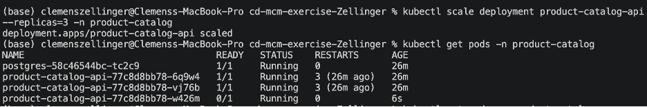

## Task 4: Production Readiness

### 1. Scaling

### 2. Health Checks
**Readiness vs Liveness probe: what's the difference?**
* **Liveness Probe:** Determines if the application inside the container is running and healthy. It answers the question, "Is the application dead or alive?"
* **Readiness Probe:** Determines if the container is fully initialized and ready to accept incoming network traffic. It answers the question, "Is the application ready to serve requests?"

**What happens when each probe fails?**
* **If Liveness fails:** The `kubelet` considers the application dead, kills the container, and restarts it according to the pod's restart policy.
* **If Readiness fails:** The container is *not* killed. Instead, Kubernetes removes the pod's IP address from the endpoints of all Services that match the pod. No traffic will be routed to it until the probe succeeds again.

**Why different `initialDelaySeconds` values?**
In `api-deployment.yml`, Readiness has `initialDelaySeconds: 5` and Liveness has `initialDelaySeconds: 15`. 
* We want a longer delay for the **Liveness probe** to give the application sufficient time to start up (e.g., connect to the database). If we checked liveness too early and it failed, Kubernetes would restart the container before it ever had a chance to fully boot, creating a continuous crash loop (`CrashLoopBackOff`).
* We use a shorter delay for the **Readiness probe** because we want Kubernetes to know the exact moment the pod *is* ready to serve traffic so it can be added to the load balancer as quickly as possible.

### 3. Resource Limits
**What happens if memory/CPU limit is exceeded?**
* **Memory Limit Exceeded:** Memory is an incompressible resource. If a container tries to allocate more memory than its limit (128Mi in our config), the kernel will terminate the container with an `OOMKilled` (Out Of Memory) error.
* **CPU Limit Exceeded:** CPU is a compressible resource. If a container tries to use more CPU than its limit (250m in our config), the container will *not* be killed. Instead, it will be CPU-throttled (artificially slowed down) to restrict its processing speed to the defined maximum limit.

**Why specify both requests and limits?**
* **Requests:** Used by the Kubernetes *Scheduler* to guarantee the pod gets this minimum amount of resources by only placing it on a node that has at least that much free capacity.
* **Limits:** Enforced by the *Kubelet/Runtime* on the node. They act as a hard cap to prevent a single misbehaving pod from hogging all the resources on the node and starving other applications.